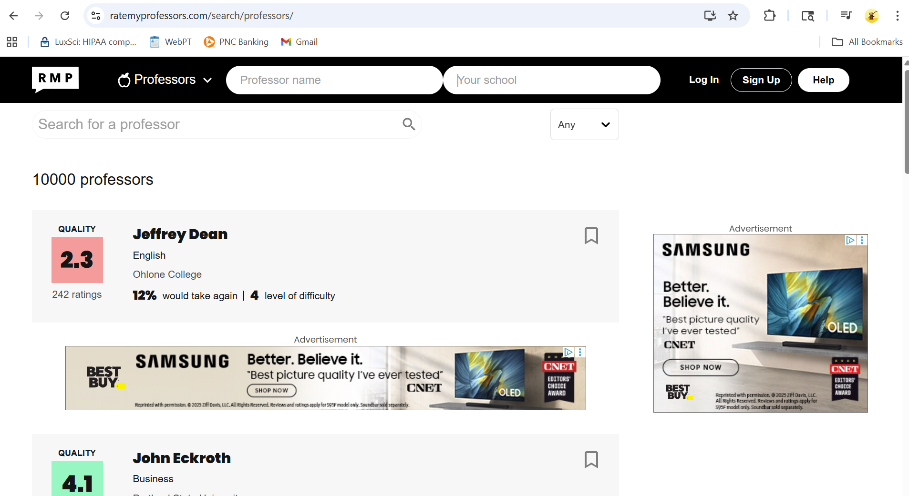

# **EduRate: A Web App for Fair Course Reviews**

EduRate is a structured, survey-based web application that enables students to make informed decisions when selecting courses and professors. Unlike existing platforms that rely on free-form user input—which can often lead to biased, inflammatory, or misleading reviews—EduRate replaces open-ended feedback with guided surveys. These surveys are then analyzed to automatically generate neutral, data-driven summaries for each course or professor.

The goal is to provide a system that balances transparency and helpfulness with fairness and professionalism, while protecting faculty from unfair attacks.

---

## **Platform Target and Technologies**

EduRate will be developed as a **Web Application**, allowing easy access across devices including desktop and mobile via browser.

### **Programming Languages**

| Layer         | Technology                          | Purpose |
|---------------|--------------------------------------|---------|
| **Frontend**  | **React.js (Hosted on Vercel)**     | Build dynamic, component-based user interfaces such as survey forms, course pages, and filterable lists. |
| **Backend**   | **Node.js + Express.js (Hosted on Render)** | Handle API routing, business logic, and communication between frontend and database. Express provides a lightweight, flexible framework for creating RESTful APIs. |
| **Database**  | **Supabase (Managed PostgreSQL)**   | Store structured, relational data such as courses, professors, survey responses, and aggregated results. Ideal for managing complex relationships and performing analytical queries. |

---

### **Why This Stack?**

- **Why React hosted on Vercel?**  

  I selected React for its component-based architecture, large community, and wide range of UI libraries. This makes React optimal to build interactive, form-driven interfaces like surveys, search filters, and data summaries, which will be the driving force for users to clearly understand and use EduRate. I chose to host the frontend of my project on Vercel because of the easy one-click deployment from GitHub (CI/CD built in), the minimal complexity of setup and usage, and the optimized features Vercel provides for React apps.

- **Alternative to React**  

  **Vue.js** offered a lightweight and easy-to-use alternative to React, although it did not offer the large ecosystem that React provides, such as extensive third-party libraries and a large community with lots of documentation, making it easier to learn from others.

- **Alternative to Vercel**  

  I considered **Netlify** to host my frontend because it also offers easy-to-use features and strong documentation, but after research, I learned it was better suited for more static sites, and Vercel's performance with React integration gave it the edge over Netlify.

- **Why Node.js + Express.js hosted on Render?**  

  Node.js enables JavaScript across the full stack, reducing the learning curve for me to switch between multiple languages. Express provides a minimalist framework that allows for fast API development, especially suited for RESTful interactions with survey data. I also chose to host my backend on Render given it provides an easy-to-deploy service, so once I push to GitHub, my backend becomes live. It provides a free service, and Render supports persistent storage if needed, which helps my backend run continuously, making it easier to handle ongoing interactions and database operations.

- **Alternative to Node.js + Express.js**  

  **Flask** was the strongest competitor given it is strong in data handling and rapid development, but using a different language from the frontend increases complexity and slows down full-stack development.

- **Alternative to Render**  

  The most appealing alternative to Render was **Railway.app** given its full-stack hosting and easy-to-use service, but Render's documentation and free-tier usage created the edge in my decision-making process.

- **Why Supabase (Managed PostgreSQL)**  

  I chose Supabase because it offers a fully managed relational database with built-in features like authentication, real-time APIs, and an intuitive dashboard — all without the overhead of manual setup. Its support for structured, relational data makes it ideal for managing courses, professors, and survey responses in EduRate.

- **Alternatives to Supabase**  

  I looked into MongoDB Atlas as a possible alternative to Supabase, which is a document-oriented system providing a flexible schema and lots of tools for development. This option was edged out because it was not ideal for relational queries such as joining surveys to courses and professors, and I found this method more complex than SQL.

---

## **Package/Dependency Management**

EduRate will use **npm (Node Package Manager)** to manage both frontend and backend dependencies.

- On the **frontend**, npm will handle React libraries, routing, form validation tools, and UI components.
- On the **backend**, npm will manage Express middleware, PostgreSQL clients, authentication tools, and API helpers.

- While **Yarn** was considered for its performance advantages, **npm** was selected due to its tighter integration with Vercel and Render, along with its strong ecosystem support and simplicity for full-stack JavaScript development.

- I will also be using a **monorepo structure**. This will allow me to manage both the frontend and backend within the same repository, simplifying development and deployment. It will be divided internally into two subsections .

---

## **Key Features**

- **Survey-Based Feedback**  
  Students rate courses and professors using multiple-choice and scaled questions instead of open-ended reviews.

- **Auto-Generated Summaries**  
  Survey results are aggregated and summarized using natural language templates or AI-powered text generation.

- **Upvoting System**  
  Students can upvote helpful reviews, surfacing the most credible summaries.

- **Hate Speech Prevention**  
  By removing open text input, EduRate reduces the chance of toxic or defamatory content.

- **Search and Filter Tools**  
  Allows students to browse and filter professors and courses by department, difficulty, workload, and more.

---

## **UI Display Idea** 

 

- This image is a great example of some key features I would like to include such as a search bar for the course or professor and the rating scale. 

---

## **Comparison to Existing Solutions**

### 1. **RateMyProfessors**  
- **Link:** [https://www.ratemyprofessors.com](https://www.ratemyprofessors.com)  
- **Type of Source:** Primary source – publicly available web platform  
- **Relation to EduRate:** Competing program  

**Description:**  
RateMyProfessors allows anonymous reviews of professors using numerical ratings and free-text comments. It includes ratings for helpfulness, clarity, and easiness.

**Feature Discussion:**  
While popular, RateMyProfessors suffers from unfiltered and sometimes abusive content. EduRate improves on this by enforcing structured input, eliminating subjective narratives, and using automatic summaries for fairness.

---

### 2. **Niche College Reviews**  
- **Link:** [https://www.niche.com/colleges/search/best-professors](https://www.niche.com/colleges/search/best-professors)  
- **Type of Source:** Secondary source – review aggregator  
- **Relation to EduRate:** Comparable platform  

**Description:**  
Niche compiles user-generated ratings about colleges, professors, and academic life. It uses a mix of quantitative surveys and optional written reviews.

**Feature Discussion:**  
Niche supports structured data but still allows free-text submissions. EduRate goes further by entirely removing open-ended feedback, focusing on unbiased summaries and reducing toxicity.

---

### 3. **Glassdoor**  
- **Link:** [https://www.glassdoor.com](https://www.glassdoor.com)  
- **Type of Source:** Secondary source – workplace review site  
- **Relation to EduRate:** Inspirational model for anonymous, structured feedback  

**Description:**  
Glassdoor collects employee reviews about workplaces, salaries, and management using structured questions and optional comments.

**Feature Discussion:**  
Glassdoor’s structure helps users make informed job decisions, but it still faces bias in user comments. EduRate adopts its structured approach but replaces subjective comments with auto-generated reviews from aggregated data.

---

### 4. **Coursicle**  
- **Link:** [https://www.coursicle.com](https://www.coursicle.com)  
- **Type of Source:** Primary source – course scheduling tool  
- **Relation to EduRate:** Complementary app  

**Description:**  
Coursicle helps students plan class schedules and notifies them when seats open. It includes some basic course ratings.

**Feature Discussion:**  
While helpful for registration, Coursicle lacks deep course/professor feedback. EduRate enhances this space with in-depth, structured, and unbiased course reviews.

---

### 5. **React Documentation**  
- **Link:** [https://reactjs.org/docs/getting-started.html](https://reactjs.org/docs/getting-started.html)  
- **Type of Source:** Technical documentation  
- **Relation to EduRate:** Primary frontend framework  

**Description:**  
The official React documentation provides comprehensive guides, tutorials, and API references to help me get started with using React.

**Feature Discussion:**  
EduRate uses React to build an interactive survey system and responsive UI. The documentation is a key resource to implement best practices in component architecture and state management.

--- 

### 6. **Supabase Documentation**  
- **Link:** [https://supabase.com/docs](https://supabase.com/docs)  
- **Type of Source:** Technical documentation  
- **Relation to EduRate:** Backend database and authentication provider  

**Description:**  
Supabase provides open-source tools to build apps with a PostgreSQL database, real-time subscriptions, and user authentication. The documentation includes setup guides, SQL syntax, API usage, and security practices.

**Feature Discussion:**  
EduRate relies on Supabase to manage structured relationships between students, courses, and survey responses. This documentation will help enable efficient schema designs and safe querying for analytics.

---

### 7. **Render Deployment Guides**  
- **Link:** [https://render.com/docs](https://render.com/docs)  
- **Type of Source:** Technical documentation  
- **Relation to EduRate:** Backend deployment platform  

**Description:**  
Render's documentation outlines how to deploy and manage web services, background workers, and persistent environments with CI/CD integration.

**Feature Discussion:**  
EduRate's backend is deployed on Render for scalability and simplicity. The docs support continuous deployment workflows and allow the backend to reliably serve APIs to the frontend and database.

---

## **References**

[1] RateMyProfessors, “Rate My Professors,” [Online]. Available: https://www.ratemyprofessors.com  
[2] Niche, “Best Professors Ranking,” [Online]. Available: https://www.niche.com/colleges/search/best-professors  
[3] Glassdoor, “Company Reviews,” [Online]. Available: https://www.glassdoor.com  
[4] Coursicle, “Class Scheduling Made Easy,” [Online]. Available: https://www.coursicle.com  
[5] ReactJS, “React Documentation,” [Online]. Available: https://reactjs.org/docs/getting-started.html  
[6] Supabase, “Supabase Docs,” [Online]. Available: https://supabase.com/docs  
[7] Render, “Render Deployment Guides,” [Online]. Available: https://render.com/docs